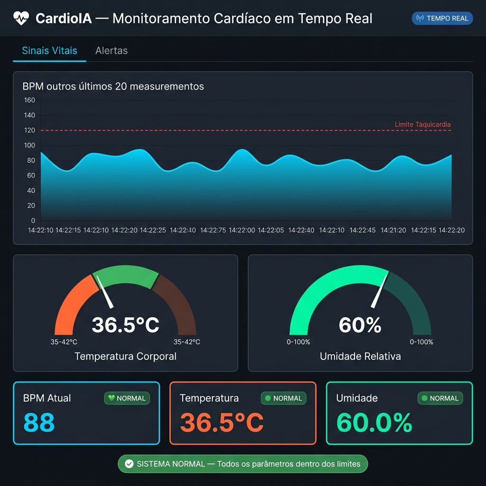
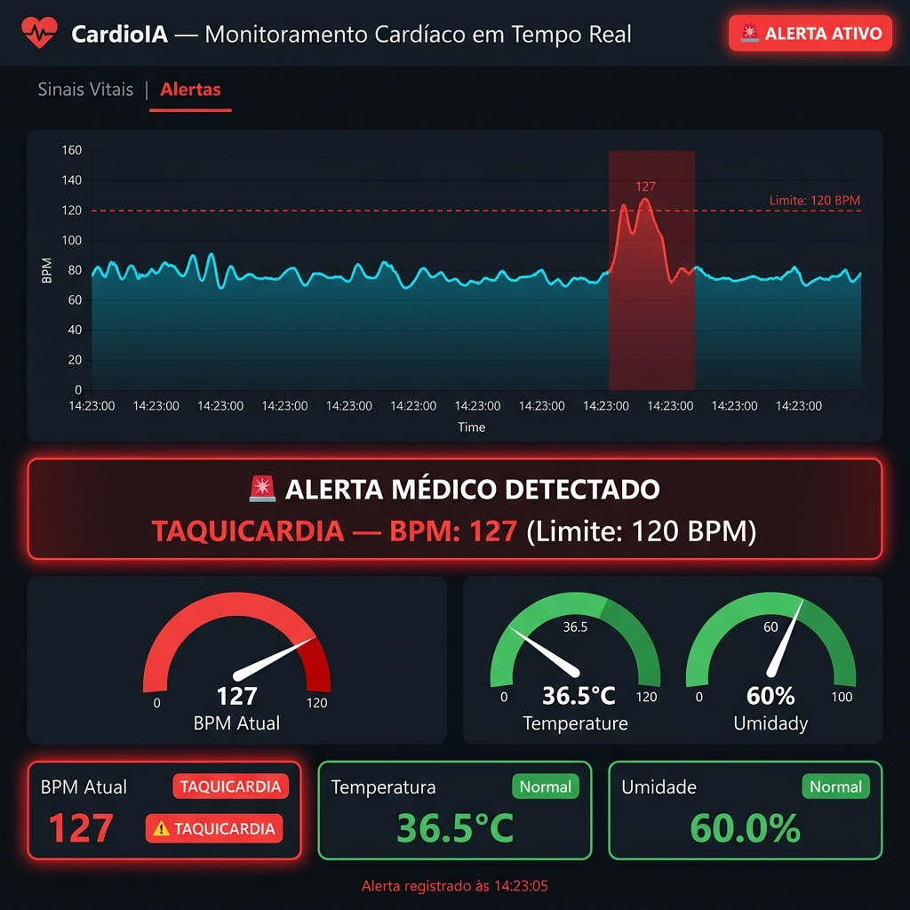
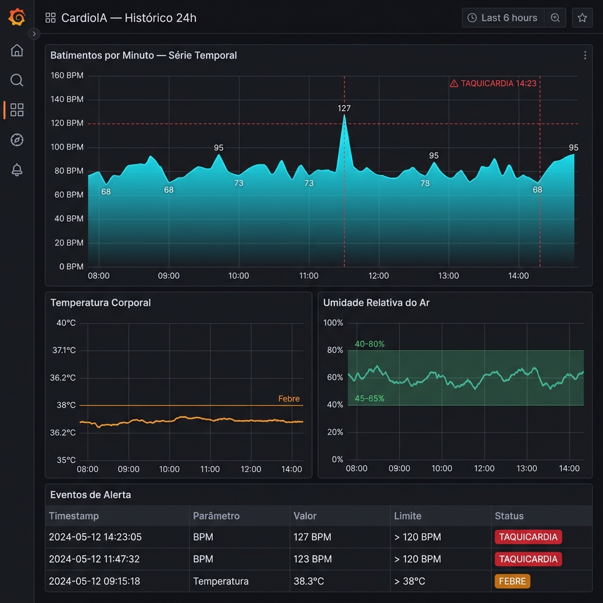
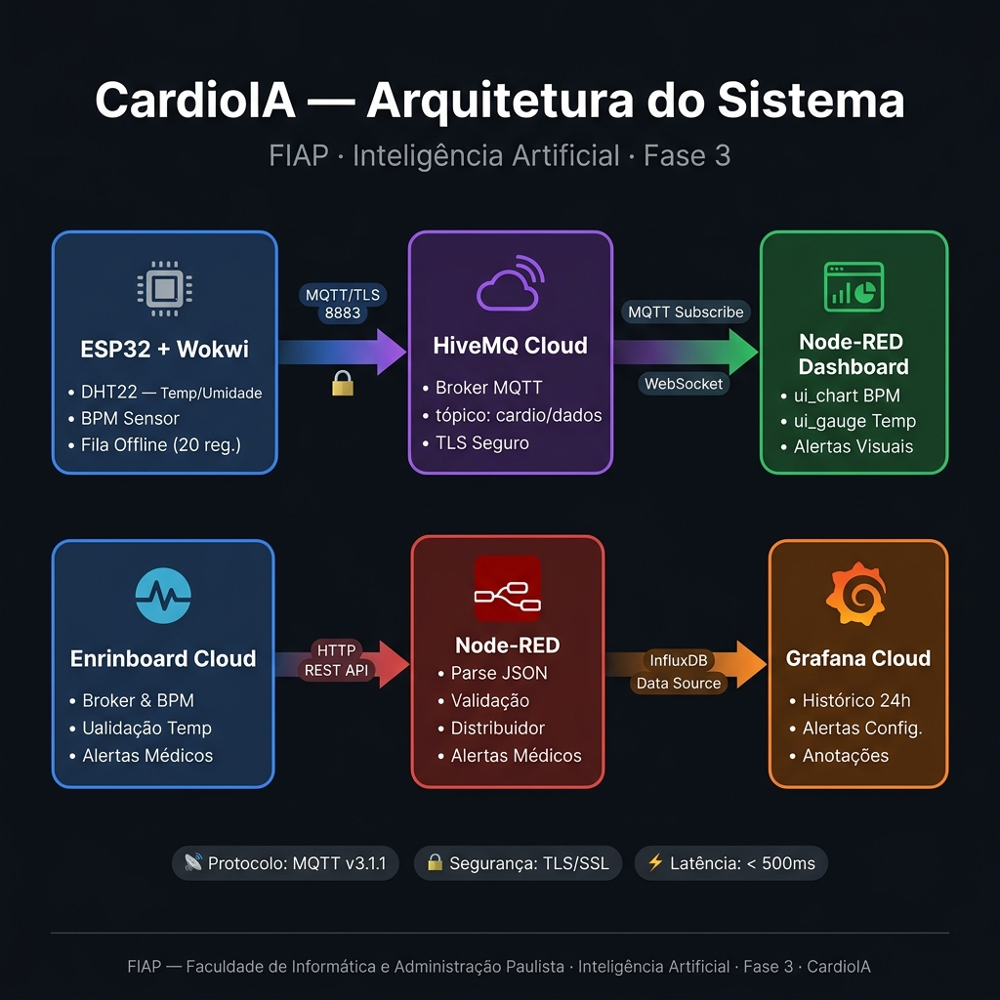

# FIAP — Faculdade de Informática e Administração Paulista

<p align="center">
  <a href="https://www.fiap.com.br/">
    
  </a>
</p>

<br>

---

## 🫀 CardioIA — Fase 3

> Sistema de monitoramento cardíaco contínuo via IoT com Edge Computing, MQTT e dashboard em tempo real.

[](https://wokwi.com/projects/463299672900584449)
[](https://nodered.org/)
[](https://grafana.com/)
[](https://www.hivemq.com/mqtt-cloud-broker/)
[](https://www.espressif.com/)
[](https://www.fiap.com.br/)

---

## 👨‍🎓 Integrantes

| Nome | RM | Contribuição |
|---|---:|---|
| João | RM565999 | Hardware — ESP32 + sensores no Wokwi |
| Tayná Esteves | RM562491 | Backend — MQTT + nuvem + alertas |
| Carlos Eduardo | RM566487 | Frontend — Node-RED + dashboard + Grafana |
| Endrew Alves | RM563646 | Documentação — Relatórios + IA |

## 👩‍🏫 Professores

### Tutor(a)
- <a href="https://www.linkedin.com/in/john-paul-lima/">John Paul Lima</a>

### Coordenador(a)
- <a href="https://www.linkedin.com/in/andregodoichiovato/">André Godoi Chiovato</a>

---

## 📋 Índice

- [Visão Geral do Projeto](#visão-geral-do-projeto)
- [Arquitetura do Sistema](#arquitetura-do-sistema)
- [Parte 1 — Hardware (ESP32 + Wokwi)](#parte-1--hardware-esp32--wokwi)
- [Parte 2 — Comunicação MQTT e Edge Computing](#parte-2--comunicação-mqtt-e-edge-computing)
- [Parte 3 — Dashboard Node-RED](#parte-3--dashboard-node-red)
- [📸 Screenshots e Dashboards](#-screenshots-e-dashboards)
- [Estrutura de Arquivos](#estrutura-de-arquivos)
- [Limites de Alerta Médico](#limites-de-alerta-médico)
- [Payload JSON](#payload-json)

---

## Visão Geral do Projeto

O **CardioIA** é um sistema de monitoramento de sinais vitais baseado em IoT que simula o comportamento de um dispositivo médico embarcado. Utiliza um microcontrolador **ESP32** para coletar dados de temperatura, umidade e batimentos cardíacos (BPM), transmiti-los via **MQTT** para a nuvem e exibi-los em um **dashboard em tempo real** com alertas médicos automáticos.

### Status de Implementação

| Parte | Descrição | Status |
|:---:|---|:---:|
| **1** | Hardware — ESP32, sensores e Edge Computing (Wokwi) | ✅ Concluído |
| **2** | Backend — Broker MQTT (HiveMQ Cloud) e integração Node-RED | ✅ Concluído |
| **3** | Dashboard — Node-RED completo com alertas e visualização | ✅ Concluído |

---

## Arquitetura do Sistema

```
┌─────────────────────────────────────────────────────────────────────┐
│                         ARQUITETURA GERAL                           │
│                                                                     │
│  ┌──────────────┐     MQTT/TLS      ┌───────────────────────────┐  │
│  │   ESP32      │ ─────────────────▶│     HiveMQ Cloud          │  │
│  │  (Wokwi)     │   cardio/dados    │     Broker MQTT           │  │
│  │              │                   │     Porta 8883 (TLS)      │  │
│  │  • DHT22     │                   └───────────┬───────────────┘  │
│  │  • Potenc.   │                               │                  │
│  │  • Fila      │                               ▼                  │
│  │    Offline   │                   ┌───────────────────────────┐  │
│  └──────────────┘                   │        Node-RED           │  │
│                                     │                           │  │
│                                     │  MQTT IN → Parse JSON     │  │
│                                     │  → Validação → Dashboard  │  │
│                                     │                           │  │
│                                     │  Tab 1: Sinais Vitais     │  │
│                                     │  Tab 2: Alertas           │  │
│                                     └───────────────────────────┘  │
└─────────────────────────────────────────────────────────────────────┘
```

---

## Parte 1 — Hardware (ESP32 + Wokwi)

### Descrição

Circuito virtual no Wokwi simulando um dispositivo de monitoramento cardíaco com ESP32. Implementa lógica de Edge Computing com fila offline para garantir zero perda de dados em caso de instabilidade de rede.

🔗 **Link da simulação:** [wokwi.com/projects/463299672900584449](https://wokwi.com/projects/463299672900584449)

📺 **Vídeo demonstrativo:** [Assista ao funcionamento do sistema no YouTube](https://www.youtube.com/watch?v=OR99ABXvCMg)

### Checklist

- [x] Circuito montado no Wokwi (ESP32 + DHT22 + potenciômetro + LEDs)
- [x] Leitura do DHT22 — temperatura (°C) e umidade (%)
- [x] Leitura de BPM simulada via potenciômetro (60–115 BPM em repouso)
- [x] Loop de leitura a cada 5 segundos
- [x] Fila offline circular com até 20 registros (Edge Computing)
- [x] Sincronização automática ao reconectar ao WiFi
- [x] Simulação de WiFi alternando a cada 30 segundos
- [x] Sistema de alertas médicos (taquicardia, febre, umidade)
- [x] LEDs indicadores (WiFi e alertas)
- [x] Código C++ comentado em português
- [x] Testes unitários da lógica (`test_sistema.py`)

### Pinagem do ESP32

| Componente | Pino | Função |
|---|:---:|---|
| DHT22 | GPIO 4 | Leitura de temperatura (°C) e umidade (%) |
| Potenciômetro | GPIO 32 | Referência ADC — simula BPM |
| LED Verde | GPIO 2 | Indicador de status WiFi |
| LED Vermelho | GPIO 15 | Indicador de alerta médico ativo |

### Saída Esperada no Monitor Serial

```
========================================
  CardioIA - Monitoramento Cardiaco
  Fase 3: Edge Computing + IoT Medico
========================================
[TESTE] Verificando sensores...
  - BPM inicial: 87 BPM
  - Temperatura: 36.5 C
  - Umidade: 60.0%
[OK] Sistema pronto. WiFi inicia DESCONECTADO.
========================================

[WIFI] DESCONECTADO - Modo offline ativado

[10951ms] BPM: 73 | Temp: 36.5C | Umidade: 60.0% | Status: OFFLINE
    -> Fila local: [1/20]
[15959ms] BPM: 91 | Temp: 36.5C | Umidade: 60.0% | Status: OFFLINE
    -> Fila local: [2/20]

[WIFI] CONECTADO - Modo online ativado
   Iniciando sincronizacao automatica...
========================================
[SYNC] Sincronizando 5 registro(s) offline...
========================================
[10951ms] BPM: 73 | Temp: 36.5C | Umidade: 60.0% | Status: SYNC->CLOUD
...
========================================
[SYNC] Concluido. Fila limpa.
========================================

[36049ms] BPM: 88 | Temp: 36.5C | Umidade: 60.0% | Status: ONLINE
    -> Enviado para nuvem via MQTT
```

### Como Usar no Wokwi

1. Acesse [wokwi.com](https://wokwi.com) e crie um novo projeto ESP32
2. Cole o conteúdo de `wokwi/sketch.ino`
3. Importe o circuito de `wokwi/diagram.json`
4. Inicie a simulação
5. Abra o Monitor Serial (aba **OUTPUT**, baud **115200**)
6. Clique no DHT22 durante a simulação para alterar temperatura e umidade manualmente

---

## Parte 2 — Comunicação MQTT e Edge Computing

### Descrição

Implementação da comunicação entre o ESP32 e a nuvem via protocolo MQTT com suporte a TLS. O sistema garante entrega confiável de dados mesmo em cenários de instabilidade de rede, graças à estratégia de Edge Computing com fila local.

### Configuração do Broker MQTT

| Parâmetro | Valor |
|---|---|
| Provedor | HiveMQ Cloud |
| Protocolo | MQTT v3.1.1 |
| Porta | 8883 (TLS/SSL) |
| Autenticação | Usuário e senha |
| Tópico | `cardio/dados` |

### Estratégia de Edge Computing

| Situação de Rede | Comportamento do Sistema |
|---|---|
| 🟢 Online | Envio imediato via MQTT para a nuvem |
| 🔴 Offline | Armazenamento em fila circular local (até 20 registros) |
| 🔄 Reconexão | Sincronização automática — fila drenada em ordem cronológica |

### Fluxo de Funcionamento

```
1. Coletar dados (BPM, temperatura, umidade)
       ↓
2. Verificar status da conexão WiFi/MQTT
       ↓
   ┌───────────────┬─────────────────┐
   ▼               ▼                 ▼
ONLINE          OFFLINE          RECONEXÃO
   │               │                 │
Envia via       Armazena na      Sincroniza
MQTT            fila local       fila → MQTT
                (até 20 itens)   (origem: SYNC->CLOUD)
```

### Resultados da Implementação

- ✅ Conexão segura com HiveMQ Cloud via TLS na porta 8883
- ✅ Publicação contínua no tópico `cardio/dados`
- ✅ Fila offline funcional — zero perda de dados
- ✅ Sincronização automática validada com campo `origem: "SYNC->CLOUD"`
- ✅ Recepção e visualização dos dados confirmadas no Node-RED

---

## Parte 3 — Dashboard Node-RED

### Descrição

Dashboard completo de monitoramento cardíaco em tempo real implementado no Node-RED, com duas abas temáticas, gráficos, medidores, indicadores de alerta e histórico de eventos.

### Checklist

- [x] Gráfico de série temporal — BPM (últimos 30 pontos)
- [x] Gauge de temperatura corporal (35–42°C, 3 faixas de cor)
- [x] Gauge de umidade relativa (0–100%, zona normal destacada)
- [x] Indicador visual de alerta — NORMAL / ALERTA ATIVO
- [x] Mensagem descritiva do alerta (ex.: `TAQUICARDIA — BPM: 127`)
- [x] Cards com valores atuais de BPM, temperatura e umidade
- [x] Indicador de origem do dado (`tempo_real` vs `SYNC->CLOUD`)
- [x] Histórico de eventos de alerta com hora local
- [x] Validação e tratamento de payload incompleto
- [x] Nós nomeados em português
- [x] `flows.json` exportado e importável

### Pacotes Necessários

| Pacote | Versão Mínima | Função |
|---|:---:|---|
| `node-red-dashboard` | 3.x | Todos os widgets de UI (`ui_chart`, `ui_gauge`, `ui_text`, `ui_led`) |

### Arquitetura do Fluxo Node-RED

```
[MQTT IN — cardio/dados]
        │
        ▼
[Parse JSON — Payload]
        │
        ▼
[Validar e Enriquecer Payload]
        │
        ▼
[Distribuidor de Mensagens] ──────────────────────────────┐
        │                                                  │
        ├─▶ [Gráfico BPM — Série Temporal]                 │
        │                                                  │
        ├─▶ [Gauge — Temperatura Corporal]                 │
        │                                                  │
        ├─▶ [Gauge — Umidade Relativa]                     │
        │                                                  │
        ├─▶ [Formatar Cards] ──▶ Card BPM                  │
        │                   └──▶ Card Temperatura          │
        │                   └──▶ Card Umidade              │
        │                   └──▶ Card Origem               │
        │                                                  │
        └─▶ [Lógica de Alerta] ──▶ Status (NORMAL/ALERTA)  │
                               └──▶ Mensagem Descritiva   │
                               └──▶ LED Indicador          │
                               └──▶ Histórico de Eventos  ◀┘
```

### Mapeamento dos Nós

| Nó | Tipo | Tab/Grupo | Função |
|---|---|---|---|
| `MQTT IN — cardio/dados` | `mqtt in` | — | Recebe mensagens do ESP32 via HiveMQ Cloud (TLS 8883) |
| `Parse JSON — Payload` | `json` | — | Converte string → objeto JavaScript |
| `Validar e Enriquecer Payload` | `function` | — | Valida campos, aplica defaults e calcula alertas individuais |
| `Distribuidor de Mensagens` | `function` | — | Cria 5 saídas para cada grupo de widgets |
| `Gráfico BPM — Série Temporal` | `ui_chart` | Sinais Vitais | Linha temporal — últimos 30 pontos, eixo Y 0–160 |
| `Gauge — Temperatura Corporal` | `ui_gauge` | Sinais Vitais | Faixas: verde ≤37°C, amarelo 37–38°C, vermelho >38°C |
| `Gauge — Umidade Relativa` | `ui_gauge` | Sinais Vitais | Faixas: vermelho <40%, verde 40–80%, vermelho >80% |
| `Formatar Cards de Valores Atuais` | `function` | — | Compõe strings com ícones para os 4 cards |
| `Card BPM Atual` | `ui_text` | Sinais Vitais | Exibe BPM com ícone de status |
| `Card Temperatura Atual` | `ui_text` | Sinais Vitais | Exibe temperatura com ícone de status |
| `Card Umidade Atual` | `ui_text` | Sinais Vitais | Exibe umidade com ícone de status |
| `Card Origem do Dado` | `ui_text` | Sinais Vitais | Indica `📡 Tempo Real` ou `🔄 Sincronizado` |
| `Lógica de Alerta Médico` | `function` | — | Classifica alerta e gera mensagem descritiva |
| `Indicador de Status — NORMAL / ALERTA` | `ui_text` | Alertas | Exibe status em fonte grande com ícone |
| `Mensagem Descritiva de Alerta` | `ui_text` | Alertas | Detalha o parâmetro e valor fora do limite |
| `LED — Indicador Visual de Alerta` | `ui_led` | Alertas | Verde (normal) / Vermelho (alerta) |
| `Histórico de Eventos de Alerta` | `ui_text` | Alertas | Acumula registros de alerta com hora local |
| `DEBUG — Payload Completo` | `debug` | — | Exibe payload enriquecido no painel lateral |

### Layout do Dashboard

**Tab 1 — Sinais Vitais**

```
┌──────────────────────────────────────────────────┐
│  📊 BATIMENTOS CARDÍACOS (BPM)                   │
│  [Gráfico de linha — série temporal]              │
│  Eixo Y: 0–160 BPM | Últimas 30 leituras         │
├────────────────────────┬─────────────────────────┤
│  🌡️ TEMPERATURA         │  💧 UMIDADE             │
│  [Gauge 35–42°C]       │  [Gauge 0–100%]         │
│  Verde / Amarelo /     │  Zona normal: 40–80%    │
│  Vermelho              │                         │
├────────────────────────┴─────────────────────────┤
│  VALORES ATUAIS E ORIGEM                         │
│  BPM: 💚 88 BPM  |  Temp: 🟢 36.5°C            │
│  Umidade: 🟢 60.0%  |  Fonte: 📡 Tempo Real     │
└──────────────────────────────────────────────────┘
```

**Tab 2 — Alertas**

```
┌──────────────────────────────────────────────────┐
│  STATUS DO PACIENTE                              │
│                                                  │
│  ✅ NORMAL               [● LED verde]            │
│  Todos os parâmetros dentro dos limites.         │
│                                                  │
│  — ou, quando em alerta: —                       │
│                                                  │
│  🚨 ALERTA ATIVO          [● LED vermelho]        │
│  TAQUICARDIA — BPM: 127                          │
├──────────────────────────────────────────────────┤
│  HISTÓRICO DE EVENTOS                            │
│  [14:23:05] ⚠️ TAQUICARDIA — BPM: 127            │
│  [14:21:40] ⚠️ FEBRE — Temp: 38.6°C             │
└──────────────────────────────────────────────────┘
```

### Como Executar o Node-RED Localmente

**1. Instalação das dependências (Novo método integrado)**

O projeto agora inclui um `package.json` configurado na pasta `node-red` para facilitar a instalação do ambiente isolado.

1. Abra o terminal e navegue até a pasta `node-red`:
   ```bash
   cd node-red
   ```
2. Instale o Node-RED e as dependências do dashboard:
   ```bash
   npm install
   ```

**2. Iniciar o Node-RED**

Execute o comando abaixo (ainda na pasta `node-red`):
```bash
npm start
```

> **Aviso para usuários do Windows (PowerShell):** Se você receber um erro de "execução de scripts foi desabilitada" (UnauthorizedAccess), use o Prompt de Comando ou execute este comando alternativo:
> ```powershell
> cmd /c npm start
> ```

Isso iniciará o Node-RED localmente, carregando automaticamente o arquivo `flows.json` já configurado para o CardioIA.

**3. Conectar ao broker MQTT**

Para conectar o Node-RED ao seu broker HiveMQ Cloud:
1. Acesse o Node-RED no navegador: `http://localhost:1880`
2. Dê um duplo clique no nó `MQTT IN — cardio/dados`
3. Clique no ícone de lápis ao lado de "HiveMQ Cloud (TLS)" para editar
4. Preencha com os seus dados (Host, Porta 8883, confirme o TLS ✅, e adicione Usuário e Senha na aba Security)
5. Clique em **Update**, depois em **Done** e por fim clique em **Deploy** (botão vermelho no canto superior direito)

**4. Acessar o dashboard**

```
http://localhost:1880/ui
```

---

## 📸 Screenshots e Dashboards

### 🟢 Node-RED — Estado Normal

> Dashboard em operação com todos os sinais vitais dentro dos limites seguros.
> BPM estável entre 65–95, temperatura 36.5°C, umidade 60%.



---

### 🔴 Node-RED — Alerta Ativo (Taquicardia)

> Sistema em estado de alerta com BPM de 127, acima do limite de 120 BPM.
> Indicador visual piscante e notificação de taquicardia ativados.



---

### 📊 Grafana — Painel Histórico 6h

> Visualização histórica dos sinais vitais nas últimas 6 horas.
> Inclui anotação do evento de taquicardia, thresholds configurados
> e tabela de eventos de alerta com timestamps.



---

### 🏗️ Arquitetura do Sistema — Fluxo Completo

> Diagrama do fluxo de dados do CardioIA:
> ESP32/Wokwi → HiveMQ Cloud (MQTT/TLS) → Node-RED → Dashboard → Grafana Cloud



---

## Estrutura de Arquivos

```
FIAP-CardioIA-Fase3/
│
├── README.md                    # Este documento
├── CardioIA_Fase3.pdf           # Enunciado do projeto
│
├── wokwi/                       # Parte 1 — Hardware
│   ├── sketch.ino               # Código principal (usar no Wokwi)
│   ├── src/main.cpp             # Mesmo código para PlatformIO
│   ├── diagram.json             # Circuito virtual do ESP32
│   ├── platformio.ini           # Configuração PlatformIO
│   ├── libraries.txt            # Bibliotecas necessárias
│   ├── wokwi.toml               # Configuração do simulador
│   └── test_sistema.py          # Testes unitários da lógica
│
├── node-red/                    # Parte 3 — Dashboard
│   └── flows.json               # Fluxo completo importável
│
├── docs/                        # Documentação visual
│   └── images/
│       ├── 01_nodered_normal.png    # Dashboard Node-RED — estado normal
│       ├── 02_nodered_alerta.png    # Dashboard Node-RED — alerta ativo
│       ├── 03_grafana_historico.png # Grafana — painel histórico 6h
│       └── 04_arquitetura_fluxo.png # Diagrama de arquitetura do sistema
│
└── prints/                      # Screenshots originais de validação
    ├── print1-hivemq.png
    ├── print2-hivemq.png
    ├── print3-hivemq.png
    ├── print4-hivemq.png
    └── printNODERED.png
```

---

## Limites de Alerta Médico

| Parâmetro | Faixa Normal | Condição de Alerta | Mensagem Gerada |
|---|:---:|---|---|
| BPM | 60 – 120 | > 120 BPM | `TAQUICARDIA — BPM: {valor}` |
| Temperatura | ≤ 38°C | > 38°C | `FEBRE — Temp: {valor}°C` |
| Umidade | 40% – 80% | < 40% | `UMIDADE MUITO BAIXA — {valor}%` |
| Umidade | 40% – 80% | > 80% | `UMIDADE MUITO ALTA — {valor}%` |

---

## Payload JSON

Estrutura dos dados publicados pelo ESP32 no tópico `cardio/dados`:

```json
{
  "timestamp": 113551,
  "bpm": 68,
  "temperatura": 36.5,
  "umidade": 60.0,
  "alerta": false,
  "origem": "tempo_real"
}
```

| Campo | Tipo | Descrição |
|---|---|---|
| `timestamp` | `number` | Tempo em ms desde o boot do ESP32 |
| `bpm` | `number` | Batimentos por minuto (simulado via potenciômetro) |
| `temperatura` | `number` | Temperatura em graus Celsius (DHT22) |
| `umidade` | `number` | Umidade relativa do ar em % (DHT22) |
| `alerta` | `boolean` | `true` se qualquer parâmetro está fora do limite |
| `origem` | `string` | `"tempo_real"` (online) ou `"SYNC->CLOUD"` (sincronizado offline) |

---

<div align="center">

**FIAP — Faculdade de Informática e Administração Paulista**
Curso de Inteligência Artificial · 2025/2026

</div>
